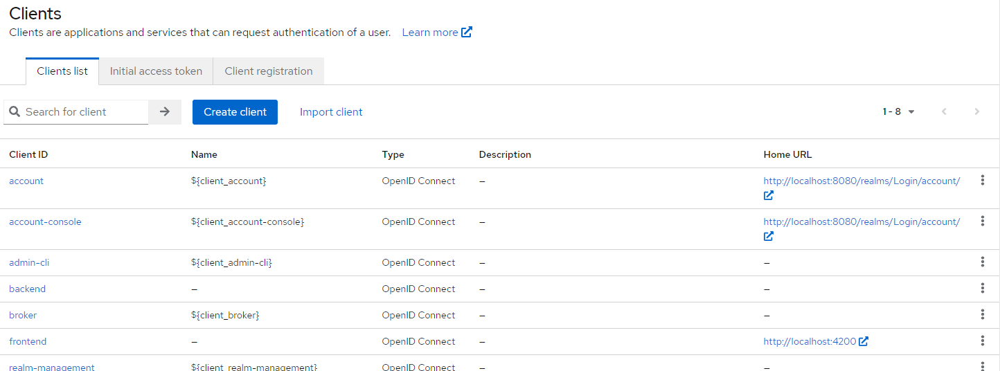
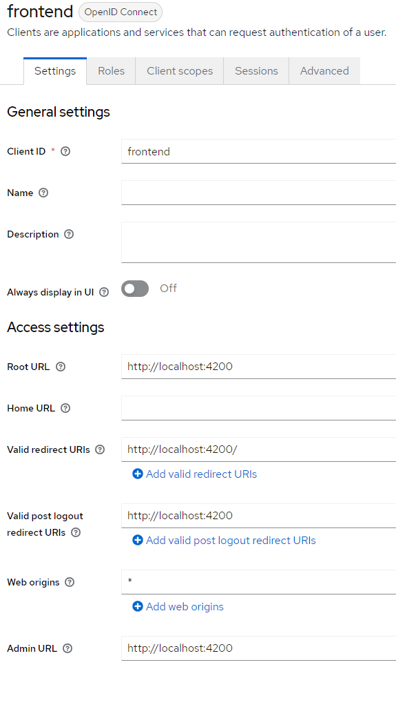
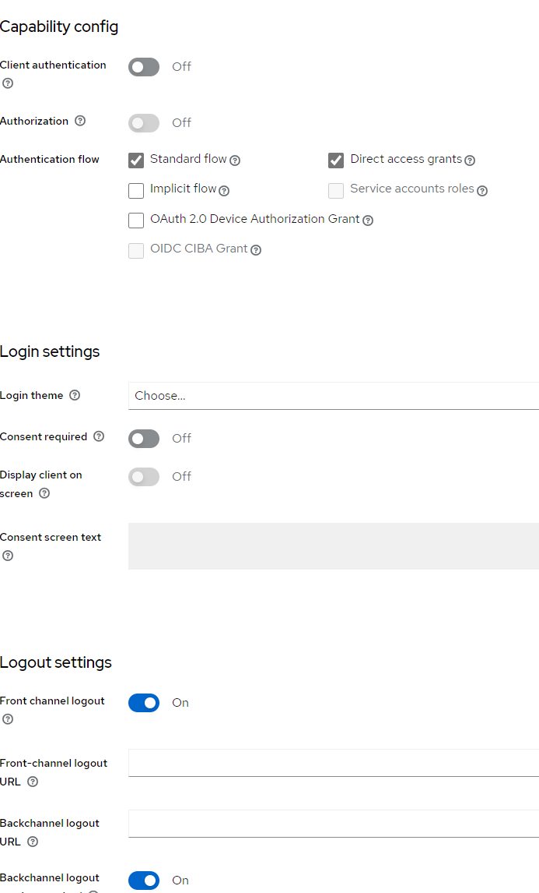
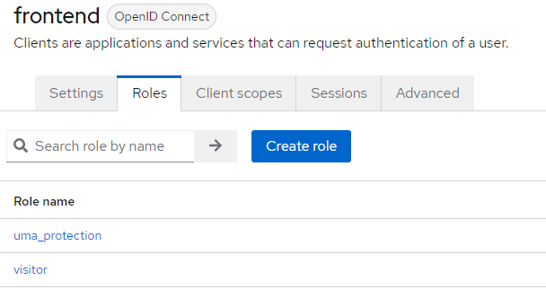
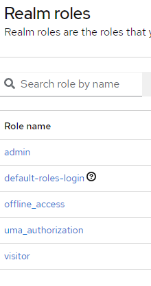
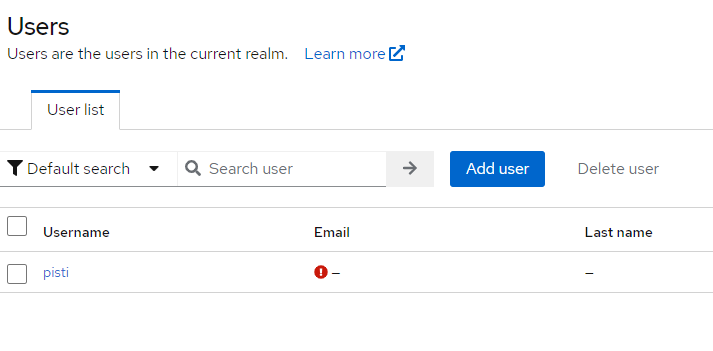
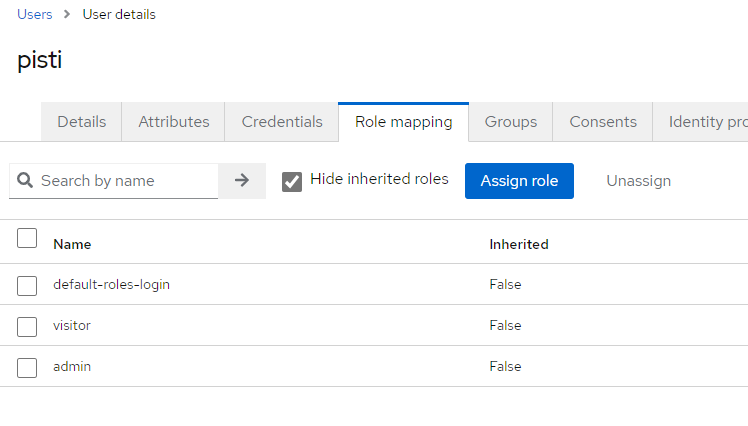
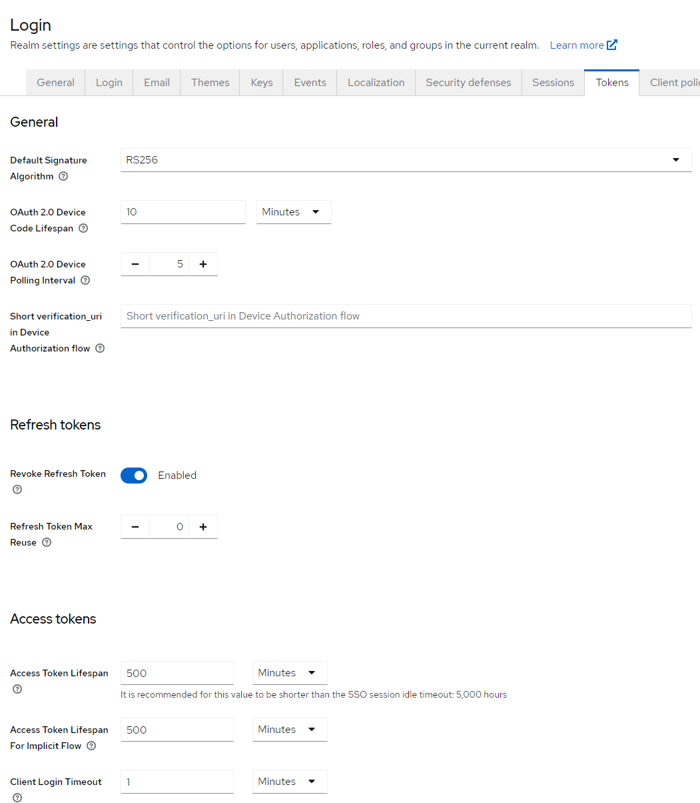
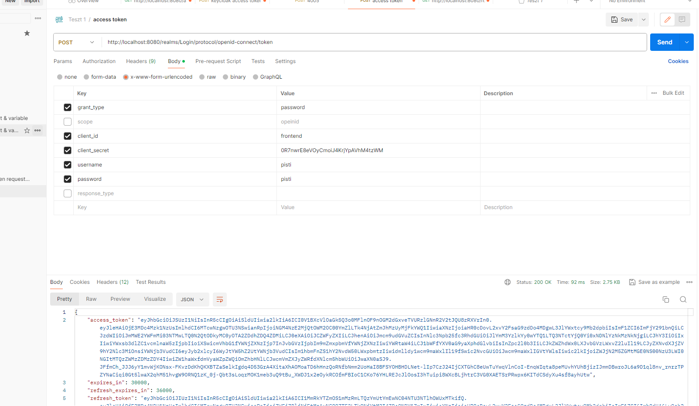

https://medium.com/@rayen19952/securing-angular-app-routes-using-keycloack-4fdb2622223e

https://hamdi-bouallague.medium.com/secure-your-angular-spring-boot-application-using-keycloak-891efab50db8

https://gauthier-cassany.com/posts/spring-boot-keycloak

https://stackoverflow.com/questions/77600996/how-to-import-keycloak-module-using-standalone-components-and-without-ngmodule

https://wkrzywiec.medium.com/step-by-step-guide-how-integrate-keycloak-with-angular-application-d96b05f7dfdd

// proxy, CORS
https://plainenglish.io/blog/all-you-need-to-know-about-angular-proxy-configuration

https://medium.com/@rayen19952/dockerizing-spring-boot-application-aee3b7d6931b

https://www.npmjs.com/package/keycloak-angular

https://miloszeljko.com/step-by-step-guide-setting-up-keycloak-oauth2-in-angular-and-net-core-for-secure-authentication/

JBoss has developed Keycloak as a Java-based open-source Identity and Access Management solution. Besides the support of both OAuth 2.0 and OIDC, 
it also offers features like identity brokering, user federation, and SSO.

Keycloak is an Identity and Access Management Server.

OAuth is a protocol that enables applications to access resources on behalf of a user. It works by having the user authorize a third-party application
to access their resources, such as their social media profile, without sharing their login credentials.
On the other hand, OpenID Connect is an authentication protocol that builds on top of OAuth 2.0 to enable user authentication.
It provides a standardized way for users to authenticate with an identity provider (IdP) and then receive an ID token, which can be used to access protected resources.

Identity Provider / authorization Server: ist ein Service, das authentifiziert den User und es liefert user credentials für das Service Provider. Es verwaltet den User Identity und seine
Zugriffsrechte. Keycloak. Verifiziert und identifiziert den User, und generiert ein access token das der client verwendet, um auf ein protected resource zugreigen zu können.

Service Provieder / Resource Server: REST Endpoint, Der client sendet der access token (bekommen vom Authorization server) im http header zum Resource server, das
reosurce server valieidet dann diese.

Authentication Protocol: eine Reihe von Regeln, die die Kommunikation zwischen Identity und Service Providers regeln. Protocolstypen: SAML, AuthO, OpenID ( AuthO ist ein
protocol, wogegen OpenID ist ein identity layer gebaut auf dem AuthO)
OIDC is about who someone is. OAuth 2.0 is about what they are allowed to do.

We can use Keycloak as a standalone server with an admin console or embed it in a Spring application. Once we have our Keycloak running in either of these ways, we can try the endpoints.
###########################################################################################################################################################################
keycloak telepitése és admnisztrálása
https://medium.com/@rayen19952/securing-angular-app-routes-using-keycloack-4fdb2622223e
###########################################################################################################################################################################

1.  Starten von Keycloak in developermodus
    führe aus: /keycloack-22.0.3\bin\kc.bat start-dev

2.  Öffnen KC: localhost:8080
3.  Beim ersten Login muss man einen user auf dem Login Seite erstellen: bende/bende
    !!! Action expired hiba jön: csak az edge böngészővel tudok az Administration konzolra belépni

    Konfigurieren für meine Appl.
    - Realm: umfasst user, roles und client (= frontend und backend applikationen) die gemeinsam aunthentifiziert werden.
        Name der reals die wir erstellen: Login
    - Erstellen backend und frontend clients. Users werden diesen clients unterstellt. 
         client ID: frontend
         Client type: OpenID Connect
         Client authentification: OFF : public access type
         Authentication flow: standard flow
         Direct access grant: on
         root URL: http://localhost:4200   a angular appl
         valid redirect URL: http://localhost:4200/*
         web origing: +
    - Roles eintellen zum frontend client: admin und user
    - Einrichten von Users und Zuweisen zu den Roles.
              
Ha már setup minden akkor megnézhetjük a beállitásokat:
    a Admin oldalon a dropdownbol a Login realmot kiválasztjuk és ott akkor a hozzá tartozó client, user, role ok jelennek meg ill. managelhetőek.

Postman:
    

#######################################################################################################################################################################
KEYCLOAK IN ANGULAR
#######################################################################################################################################################################

!! FONTOS !!!
Ha a keycloakot használjuk, akkor a Chromeban nem tudunk beloginolni csak az Edgeben.
Ha mégis a Chromban akarunk dolgozni, akkor a app.routing.ts ben a 16 sort és a app.config.ts ben a 30,31 sort ki kell kommentelnünk és akkor a keycloak nem lesz meghvva.

Angular applban:
   -  npm install keycloak-angular und keycloak.js
     -  Implementieren ein initializer Function, womit man des KeycloakService (vom npm package) initialisieren.
       -  im app.config.ts wir definieren ein provider:
          {provide: APP_INITIALIZER, useFactory: initializer, multi: true, deps: [KeycloakService]},    // dieses ermöglicht, dass initializer Funktion ausgeführt wird, bevor dei Appl startet
          KeycloakService
       - Implementieren ein Authguard, und wir verwenden es zum schützen unsere Pfade:
         canActivate: [AuthGuard],
         // The user need to have this roles to access
         data: { roles: ['ROLE_ADMIN'] },

Angular Frontend übergibt das Login-Verwaltung komplett dem keycloak server. Das Login Prozess ist administriert bei dem keycloak ( provider). Angular erhält ein OIDC Json 
webtoken vom Provider nach dem erfolgreichen Login und schickt es dem Spring Backend im Http Header weiter. Backend ebenfals beschäftigt sich mit dem Login Prozess nicht.

Testing Keycloak Token endpoint with Postman:
    http://localhost:8080/auth/realms/login/protocol/openid-connect/token
    https://www.baeldung.com/postman-keycloak-endpoints

http://localhost:8080/realms/Login/protocol/openid-connect/token
body: form-urlencoded
grant-type: password
client_id: frontend
client_secret: amit a client -> credetnials fülön a client secret mezőben találunk a keycloak UI-on
username:/password: pisti

#######################################################################################################################################################################
KEYCLOAK IN SPRING
#######################################################################################################################################################################

